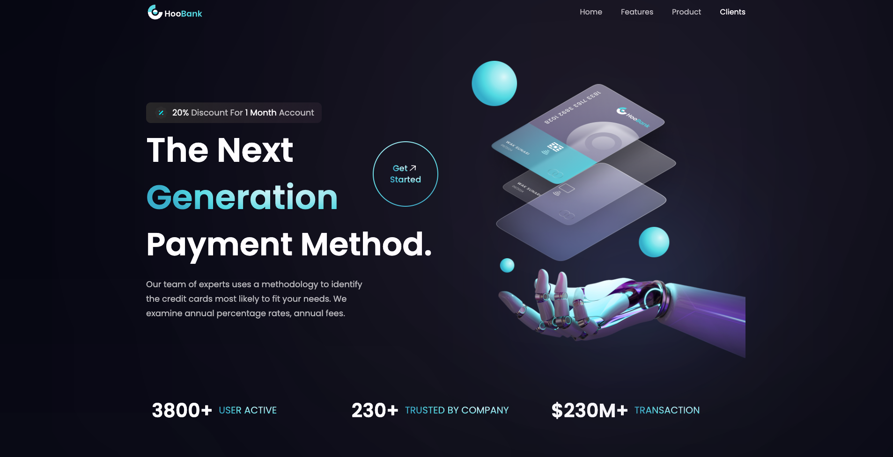

## Build React app with tailwindCSS
This is a repository for a React application, Tailwind CSS to highlight my skills in Tailwind CSS

 <h1 align="center">
  SAWADOGO Badini Ibrahim
</h1>

## About this Repository

# Figma design link
https://www.figma.com/file/bUGIPys15E78w9bs1l4tgS/HooBank?type=design&node-id=310-485&mode=design&t=culzpeBPiSSGhACh-0

# App link
https://react-app-tailwindcss-cardio-leading-iqndhleva.vercel.app/

# Technologies
- React js
- Beautiful layouts with TailwindCSS
- Create reusable components
  
# Screenshot

